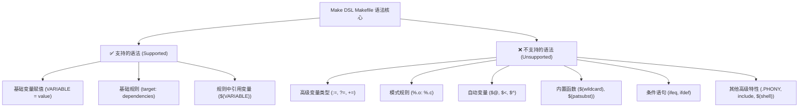

# Make DSL - Supported Makefile Syntax

This document describes the subset of Makefile syntax supported by the Make DSL compiler.

## Overview

The Make DSL compiler implements a simplified subset of GNU Make functionality, focusing on basic variable assignments and rule definitions.


## Supported Syntax Elements ✅

### 1. Variable Assignments

#### Basic Variable Assignment
```makefile
VARIABLE = value
NAME = myprogram
CC = gcc
```

#### Multi-word Values
```makefile
CFLAGS = -Wall -O2 -g
SOURCES = main.c utils.c parser.c
```

### 2. Rules

#### Basic Rules
```makefile
target: dependency1 dependency2
	command1
	command2
```

#### Examples
```makefile
program: main.o utils.o
	gcc -o program main.o utils.o

main.o: main.c
	gcc -c main.c

utils.o: utils.c utils.h
	gcc -c utils.c
```

### 3. Variables in Rules

#### Simple Variable References
```makefile
CC = gcc
program: main.c
	$(CC) -o program main.c
```

## Unsupported Syntax ❌

The following Makefile features are **not supported**:

### 1. Advanced Variable Types
- [ ] `:=` (immediate assignment)
- [ ] `?=` (conditional assignment)  
- [ ] `+=` (append assignment)
- [ ] `define` ... `endef` (multi-line variables)

### 2. Pattern Rules
- [ ] `%.o: %.c` pattern matching
- [ ] Generic wildcard rules
- [ ] Stem substitution

```makefile
# NOT SUPPORTED
%.o: %.c
	$(CC) -c $< -o $@
```

### 3. Automatic Variables
- [ ] `$@` (target name)
- [ ] `$<` (first dependency)
- [ ] `$^` (all dependencies)
- [ ] `$*` (stem in pattern rules)
- [ ] `$?` (newer dependencies)
- [ ] `$+` (all dependencies with duplicates)

### 4. Functions
- [ ] `$(wildcard *.c)` - file globbing
- [ ] `$(patsubst pattern,replacement,text)` - pattern substitution
- [ ] `$(subst from,to,text)` - string substitution
- [ ] `$(filter pattern,text)` - filtering
- [ ] `$(sort list)` - sorting
- [ ] `$(dir names)` - directory extraction
- [ ] `$(basename names)` - basename extraction
- [ ] `$(suffix names)` - suffix extraction
- [ ] `$(addprefix prefix,names)` - prefix addition
- [ ] `$(addsuffix suffix,names)` - suffix addition

```makefile
# NOT SUPPORTED
SOURCES = $(wildcard *.c)
OBJECTS = $(SOURCES:.c=.o)
```

### 5. Conditionals
- [ ] `ifeq` / `ifneq` conditions
- [ ] `ifdef` / `ifndef` conditions
- [ ] `else` / `endif` blocks
- [ ] Nested conditionals

```makefile
# NOT SUPPORTED
ifeq ($(CC),gcc)
    CFLAGS += -DGCC
endif
```

### 6. Include Statements
- [ ] `include filename` - include other makefiles
- [ ] `-include filename` - optional include
- [ ] `sinclude filename` - silent include

```makefile
# NOT SUPPORTED
include config.mk
```

### 7. Special Targets
- [ ] `.PHONY:` - declare phony targets
- [ ] `.DEFAULT:` - default target
- [ ] `.SUFFIXES:` - suffix rules
- [ ] `.PRECIOUS:` - preserve intermediate files
- [ ] `.INTERMEDIATE:` - intermediate files
- [ ] `.SECONDARY:` - secondary files
- [ ] `.DELETE_ON_ERROR:` - delete on error

```makefile
# NOT SUPPORTED
.PHONY: clean all
.DEFAULT: all
```

### 8. Advanced Features
- [ ] Shell function `$(shell command)`
- [ ] Eval function `$(eval text)`
- [ ] Call function `$(call variable,arguments)`
- [ ] Origin function `$(origin variable)`
- [ ] Flavor function `$(flavor variable)`
- [ ] Error/warning functions `$(error text)`, `$(warning text)`

### 9. Variable Modifiers
- [ ] `$(var:suffix=replacement)` - suffix replacement
- [ ] `${var}` - alternative variable syntax
- [ ] Variable indirection `$($(var))`

### 10. Control Flow
- [ ] `@` - silent command execution
- [ ] `-` - ignore command errors  
- [ ] `+` - always execute command
- [ ] Line continuation with `\` in complex contexts

### 11. Built-in Variables
- [ ] `CC`, `CXX`, `LD` - default tools
- [ ] `CFLAGS`, `CXXFLAGS`, `LDFLAGS` - default flags
- [ ] `MAKE`, `MAKEFILE_LIST` - make information
- [ ] `.VARIABLES`, `.TARGETS` - introspection

## Grammar Summary

### Lexical Elements
- **WORDS**: Regular text tokens
- **VAR**: Variables starting with `$` (e.g., `$CC`, `$NAME`)
- **SPEC**: Special characters and literals
- **BACKSLASH**: Line continuation `\`

### Syntax Rules

```ebnf
file ::= statement*
statement ::= assignment | rule

assignment ::= WORD EQUAL words
rule ::= target COLON dependencies actions

target ::= WORD | VAR | SPEC
dependencies ::= (WORD | VAR | SPEC)*
actions ::= (WORD | VAR | SPEC | BACKSLASH)*

words ::= (WORD | VAR | SPEC)*
```

## Examples of Valid Files

### Example 1: Simple Build
```makefile
CC = gcc
program: main.c
	gcc -o program main.c
```

### Example 2: Multiple Objects
```makefile
CC = gcc
CFLAGS = -Wall -O2

program: main.o utils.o
	gcc -o program main.o utils.o

main.o: main.c
	gcc -c main.c

utils.o: utils.c
	gcc -c utils.c
```

### Example 3: Variables in Commands
```makefile
CC = gcc
CFLAGS = -Wall -O2
TARGET = myapp

$(TARGET): main.c
	$(CC) $(CFLAGS) -o $(TARGET) main.c
```

## Limitations Summary

1. **No Pattern Matching**: Cannot use `%` patterns for generic rules
2. **No Automatic Variables**: Must explicitly name all files
3. **No String Manipulation**: No substitution or filtering functions
4. **Simple Dependencies**: Only direct file dependencies supported
5. **Basic Execution**: Commands are executed sequentially without optimization
6. **No Conditionals**: No if/else logic in makefiles
7. **No Functions**: No built-in or user-defined functions
8. **No Advanced Variables**: Only simple `=` assignment supported

## Notes

- Commands are executed as-is without shell interpretation
- File paths should be simple relative paths
- The compiler generates standalone OCaml executables that implement the build logic
- Focus on basic build scenarios - complex dependency management not supported