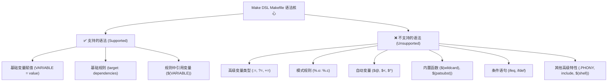

# Make DSL - 支持的 Makefile 语法

本文档详细描述了 Make DSL 编译器所支持的 Makefile 语法子集。

## 概述

Make DSL 编译器实现了一个简化的 GNU Make 功能子集，其核心专注于基础的变量赋值和规则定义。


## ✅ 支持的语法元素

### 1. 变量赋值

#### 基础变量赋值
```makefile
VARIABLE = value
NAME = myprogram
CC = gcc
```

#### 包含多个单词的值
```makefile
CFLAGS = -Wall -O2 -g
SOURCES = main.c utils.c parser.c
```

### 2. 规则

#### 基础规则
```makefile
target: dependency1 dependency2
	command1
	command2
```

#### 示例
```makefile
program: main.o utils.o
	gcc -o program main.o utils.o

main.o: main.c
	gcc -c main.c

utils.o: utils.c utils.h
	gcc -c utils.c
```

### 3. 在规则中使用变量

#### 简单变量引用
```makefile
CC = gcc
program: main.c
	$(CC) -o program main.c
```

## ❌ 不支持的语法

以下 Makefile 功能 **不被支持**：

### 1. 高级变量类型
- [ ] `:=` (立即赋值)
- [ ] `?=` (条件赋值)  
- [ ] `+=` (追加赋值)
- [ ] `define` ... `endef` (多行变量)

### 2. 模式规则
- [ ] `%.o: %.c` 模式匹配
- [ ] 通用通配符规则
- [ ] 词根替换

```makefile
# 不支持
%.o: %.c
	$(CC) -c $< -o $@
```

### 3. 自动变量
- [ ] `$@` (目标文件名)
- [ ] `$<` (第一个依赖文件名)
- [ ] `$^` (所有依赖文件名)
- [ ] `$*` (模式规则中的词根)
- [ ] `$?` (更新的依赖)
- [ ] `$+` (所有依赖，包含重复项)

### 4. 函数
- [ ] `$(wildcard *.c)` - 文件通配
- [ ] `$(patsubst pattern,replacement,text)` - 模式替换
- [ ] `$(subst from,to,text)` - 字符串替换
- [ ] `$(filter pattern,text)` - 过滤
- [ ] `$(sort list)` - 排序
- [ ] `$(dir names)` - 目录提取
- [ ] `$(basename names)` - 文件名提取
- [ ] `$(suffix names)` - 后缀提取
- [ ] `$(addprefix prefix,names)` - 添加前缀
- [ ] `$(addsuffix suffix,names)` - 添加后缀

```makefile
# 不支持
SOURCES = $(wildcard *.c)
OBJECTS = $(SOURCES:.c=.o)
```

### 5. 条件语句
- [ ] `ifeq` / `ifneq` 条件
- [ ] `ifdef` / `ifndef` 条件
- [ ] `else` / `endif` 块
- [ ] 嵌套条件

```makefile
# 不支持
ifeq ($(CC),gcc)
    CFLAGS += -DGCC
endif
```

### 6. Include 语句
- [ ] `include filename` - 包含其他 makefile
- [ ] `-include filename` - 可选包含
- [ ] `sinclude filename` - 静默包含

```makefile
# 不支持
include config.mk
```

### 7. 特殊目标
- [ ] `.PHONY:` - 声明伪目标
- [ ] `.DEFAULT:` - 默认目标
- [ ] `.SUFFIXES:` - 后缀规则
- [ ] `.PRECIOUS:` - 保留中间文件
- [ ] `.INTERMEDIATE:` - 中间文件
- [ ] `.SECONDARY:` - 次要文件
- [ ] `.DELETE_ON_ERROR:` - 出错时删除

```makefile
# 不支持
.PHONY: clean all
.DEFAULT: all
```

### 8. 高级特性
- [ ] Shell 函数 `$(shell command)`
- [ ] Eval 函数 `$(eval text)`
- [ ] Call 函数 `$(call variable,arguments)`
- [ ] Origin 函数 `$(origin variable)`
- [ ] Flavor 函数 `$(flavor variable)`
- [ ] 错误/警告函数 `$(error text)`, `$(warning text)`

### 9. 变量修饰符
- [ ] `$(var:suffix=replacement)` - 后缀替换
- [ ] `${var}` - 备用变量语法
- [ ] 变量间接引用 `$($(var))`

### 10. 控制流
- [ ] `@` - 静默执行命令
- [ ] `-` - 忽略命令错误  
- [ ] `+` - 总是执行命令
- [ ] 在复杂上下文中使用 `\` 进行换行

### 11. 内置变量
- [ ] `CC`, `CXX`, `LD` - 默认工具
- [ ] `CFLAGS`, `CXXFLAGS`, `LDFLAGS` - 默认标志
- [ ] `MAKE`, `MAKEFILE_LIST` - make自身信息
- [ ] `.VARIABLES`, `.TARGETS` - 内省变量

## 语法摘要

### 词法元素
- **WORDS**: 普通文本标记
- **VAR**: 以 `$` 开头的变量 (例如, `$CC`, `$NAME`)
- **SPEC**: 特殊字符和字面量
- **BACKSLASH**: 换行符 `\`

### 语法规则 (EBNF)

```ebnf
文件 (file) ::= 语句 (statement)*
语句 (statement) ::= 赋值 (assignment) | 规则 (rule)

赋值 (assignment) ::= 单词 (WORD) 等号 (EQUAL) 词组 (words)
规则 (rule) ::= 目标 (target) 冒号 (COLON) 依赖 (dependencies) 动作 (actions)

目标 (target) ::= 单词 (WORD) | 变量 (VAR) | 特殊字符 (SPEC)
依赖 (dependencies) ::= (单词 (WORD) | 变量 (VAR) | 特殊字符 (SPEC))*
动作 (actions) ::= (单词 (WORD) | 变量 (VAR) | 特殊字符 (SPEC) | 反斜杠 (BACKSLASH))*

词组 (words) ::= (单词 (WORD) | 变量 (VAR) | 特殊字符 (SPEC))*
```

## 有效文件示例

### 示例 1: 简单构建
```makefile
CC = gcc
program: main.c
	gcc -o program main.c
```

### 示例 2: 多个目标文件
```makefile
CC = gcc
CFLAGS = -Wall -O2

program: main.o utils.o
	gcc -o program main.o utils.o

main.o: main.c
	gcc -c main.c

utils.o: utils.c
	gcc -c utils.c
```

### 示例 3: 在命令中使用变量
```makefile
CC = gcc
CFLAGS = -Wall -O2
TARGET = myapp

$(TARGET): main.c
	$(CC) $(CFLAGS) -o $(TARGET) main.c
```

## 限制总结

1.  **无模式匹配**: 不能使用 `%` 模式来定义通用规则。
2.  **无自动变量**: 必须显式地指定所有文件名。
3.  **无字符串操作**: 不支持替换或过滤等函数。
4.  **仅支持简单依赖**: 只支持直接的文件依赖关系。
5.  **基础执行模型**: 命令按顺序执行，没有优化。
6.  **无条件逻辑**: makefile 中不能包含 if/else 逻辑。
7.  **无函数**: 不支持内置函数或用户自定义函数。
8.  **仅支持基础变量**: 只支持简单的 `=` 赋值。

## 备注

- 命令按原样执行，不经过 shell 解释。
- 文件路径应为简单的相对路径。
- 编译器会生成独立的 OCaml 可执行文件，该文件实现了构建逻辑。
- DSL 的重点是基础构建场景，不支持复杂的依赖管理。